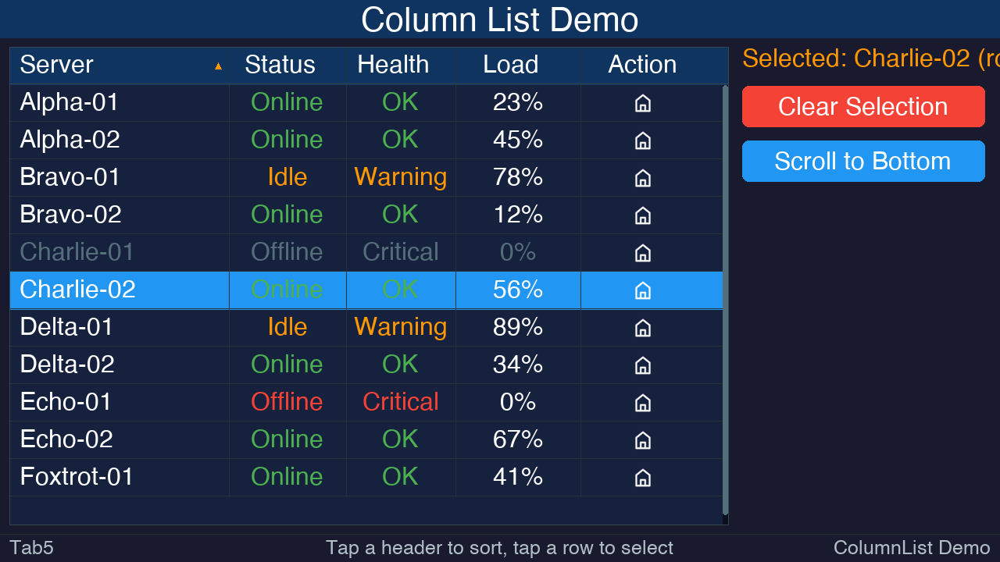

# Tab5UI — Touchscreen UI Library for M5Stack Tab5

A lightweight, Arduino-compatible UI widget library built on **M5GFX** for the M5Stack Tab5's 5-inch **1280×720** IPS capacitive touchscreen. Supports both **landscape** (1280×720) and **portrait** (720×1280) orientations.

## Features

| Widget | Description |
|---|---|
| **UILabel** | Static/dynamic text with alignment, color, and background options |
| **UIButton** | Rounded-rect button with press feedback and customizable colors |
| **UIIconButton** | Button with PROGMEM PNG icon (32×32) and text fallback, same styling as UIButton |
| **UISlider** | Horizontal slider with draggable thumb, configurable min/max range, and onChange callback |
| **UITitleBar** | Full-width top bar with center title, optional left/right touch zones |
| **UIStatusBar** | Full-width bottom bar with left/center/right text |
| **UITextRow** | Key-value row with label on left, value on right, and dividers |
| **UIIconSquare** | Colored square icon with optional character overlay |
| **UIIconCircle** | Colored circle icon with circular hit-testing |
| **UIMenu** | Modal popup menu with selectable items, separators, and auto-dismiss |
| **UITextInput** | Single-line text input field with placeholder and focus highlight |
| **UIKeyboard** | Full-screen modal QWERTY touch keyboard with Shift, Symbols, and Enter |
| **UIList** | Scrollable list with touch-drag scrolling, item selection, and scrollbar |
| **UITabView** | Multi-page tabbed container with configurable top/bottom tab bar |
| **UIInfoPopup** | Auto-sized modal info popup with title, message, and OK button |
| **UIConfirmPopup** | Auto-sized modal confirm popup with title, message, and Yes/No buttons |
| **UIScrollText** | Scrollable text display with basic Markdown rendering (headings, bold, italic, code, bullets, rules) |
| **UICheckbox** | Toggleable checkbox with label, checked state, and touch callbacks |
| **UIRadioButton** | Selectable radio button with label, managed by UIRadioGroup for mutual exclusion |
| **UIDropdown** | Compact dropdown selector with scrollable list overlay, icons, and all UIList features |
| **UIColumnList** | Multi-column list with sortable headers, per-cell text/color/icon, scrolling, and selection |
| **UITextArea** | Multi-line text input with word wrapping, touch scrolling, and tap-to-place cursor |
| **UIManager** | Registers elements, dispatches touch events, manages dirty redraws |

### Touch Handling

Every widget supports two callbacks:

```cpp
element.setOnTouch([](TouchEvent e) {
    // Finger touched down on this element
});

element.setOnTouchRelease([](TouchEvent e) {
    // Finger lifted from this element
});
```

The `UIManager::update()` method handles all touch detection, hit-testing (including circular hit-test for `UIIconCircle`), and dirty-region redraws automatically.


### Flicker-Free Rendering

Ten widgets use **sprite-buffered (double-buffered) rendering** via a shared `M5Canvas` allocated in PSRAM for flicker-free display updates. See the **[Rendering](https://github.com/mcherry/Tab5UI/wiki/Rendering)** wiki page for details and render mode configuration.

---

## Installation

### Arduino IDE (manual)

1. Copy the entire `Tab5UI` folder into your Arduino libraries directory:
   - **macOS:** `~/Documents/Arduino/libraries/Tab5UI/`
   - **Windows:** `Documents\Arduino\libraries\Tab5UI\`
   - **Linux:** `~/Arduino/libraries/Tab5UI/`

2. Install the **M5GFX** library via the Arduino Library Manager:
   - *Sketch → Include Library → Manage Libraries → search "M5GFX"*

3. Select board **M5Stack Tab5** (or the appropriate ESP32-P4 board).

### PlatformIO

Add to `platformio.ini`:

```ini
[env:tab5]
platform = espressif32
board = m5stack-tab5
framework = arduino
lib_deps =
    m5stack/M5GFX
    Tab5UI
```

---

## Quick Start

```cpp
#include <M5GFX.h>
#include <Tab5UI.h>

M5GFX display;
UIManager ui(display);

UITitleBar  titleBar("My App");
UIStatusBar statusBar("Ready");
UIButton    btn(50, 100, 200, 52, "Press Me");

void setup() {
    display.init();
    display.setRotation(1);           // Landscape (use 0 for portrait)
    Tab5UI::init(display);            // Must be called after init + rotation
    ui.setBrightness(128);
    display.setFont(&fonts::DejaVu18);

    btn.setOnTouchRelease([](TouchEvent e) {
        statusBar.setText("Button pressed!");
    });

    ui.setBackground(Tab5Theme::BG_DARK);
    ui.clearScreen();
    ui.addElement(&titleBar);
    ui.addElement(&btn);
    ui.addElement(&statusBar);
    ui.setContentArea(TAB5_TITLE_H, Tab5UI::screenH() - TAB5_STATUS_H);
    ui.drawAll();
    ui.setSleepTimeout(5);           // Screen off after 5 min idle
    ui.setLightSleep(true);          // Low-power idle with touch-to-wake
}

void loop() {
    ui.update();
    yield();
}
```

---

## Orientation Support

Tab5UI works in both **landscape** (1280×720, rotation 1) and **portrait** (720×1280, rotation 0) orientations.

Call `Tab5UI::init(display)` once in `setup()` **after** `display.init()` and `display.setRotation()`:

```cpp
void setup() {
    display.init();
    display.setRotation(0);        // 0 = portrait, 1 = landscape
    Tab5UI::init(display);         // Captures runtime screen dimensions
    // ...
}
```

### What adapts automatically

| Widget | Adaptation |
|---|---|
| **UITitleBar** | Stretches to screen width |
| **UIStatusBar** | Stretches to screen width, repositions to screen bottom |
| **UIKeyboard** | Repositions to screen bottom, keys scale to fit width |
| **UIInfoPopup** | Auto-sizes and centers within actual screen bounds |
| **UIConfirmPopup** | Auto-sizes and centers within actual screen bounds |
| **UIDropdown** | Overflow detection uses actual screen height |
| **UIManager** | Content area bottom defaults to actual screen height |

### Runtime dimension queries

```cpp
int16_t w = Tab5UI::screenW();   // Actual screen width  (720 or 1280)
int16_t h = Tab5UI::screenH();   // Actual screen height (1280 or 720)
```

Use these instead of the compile-time `TAB5_SCREEN_W` / `TAB5_SCREEN_H` macros when you need values that match the current orientation.

### Positioning widgets for portrait

Since widget objects are constructed globally (before `setup()`), use compile-time defaults or placeholder values in constructors, then call `setPosition()` / `setSize()` in `setup()` after `Tab5UI::init()`. See the **WiFi Scanner** demo for a complete portrait example.

---

## Documentation (Wiki)

Full API documentation, widget references, and screenshots are available on the **[Tab5UI Wiki](https://github.com/mcherry/Tab5UI/wiki)**:

| Page | Contents |
|---|---|
| **[Getting Started](https://github.com/mcherry/Tab5UI/wiki/Getting-Started)** | Installation, quick start, orientation support |
| **[API Reference](https://github.com/mcherry/Tab5UI/wiki/API-Reference)** | Namespace, screen constants, theme colors, UIElement base class |
| **[Widgets – Basic](https://github.com/mcherry/Tab5UI/wiki/Widgets-–-Basic)** | UILabel, UIButton, UIIconButton, UISlider, UITitleBar, UIStatusBar, UITextRow, UIIconSquare, UIIconCircle |
| **[Widgets – Input](https://github.com/mcherry/Tab5UI/wiki/Widgets-–-Input)** | UITextInput, UIKeyboard, UITextArea |
| **[Widgets – Lists](https://github.com/mcherry/Tab5UI/wiki/Widgets-–-Lists)** | UIList, UIDropdown, UIColumnList |
| **[Widgets – Containers & Popups](https://github.com/mcherry/Tab5UI/wiki/Widgets-–-Containers-&-Popups)** | UITabView, UIMenu, UIInfoPopup, UIConfirmPopup, UIScrollText |
| **[Widgets – Selection](https://github.com/mcherry/Tab5UI/wiki/Widgets-–-Selection)** | UICheckbox, UIRadioButton / UIRadioGroup |
| **[UIManager](https://github.com/mcherry/Tab5UI/wiki/UIManager)** | Element management, touch dispatch, screen sleep |
| **[Rendering](https://github.com/mcherry/Tab5UI/wiki/Rendering)** | Sprite buffering, render modes |
| **[Screenshots](https://github.com/mcherry/Tab5UI/wiki/Screenshots)** | All demo screenshots |
| **[Tips & Best Practices](https://github.com/mcherry/Tab5UI/wiki/Tips-&-Best-Practices)** | Common patterns and memory considerations |

---

## File Structure

```
Tab5UI/
├── Tab5UI.h                          # Header — all class declarations
├── Tab5UI.cpp                        # Implementation
├── library.properties                # Arduino IDE metadata
├── library.json                      # PlatformIO metadata
├── README.md                         # This file
├── CHANGELOG.md                      # Version history
├── LICENSE                           # GNU GPL v3
├── icons/                            # 32×32 PROGMEM PNG icon headers
│   ├── README.md                     # Icon attribution & usage
│   ├── LICENSE                       # Apache 2.0 (IconPark)
│   ├── icon_home.h                   # Example: home icon
│   ├── icon_search.h                 # Example: search icon
│   └── ... (55 icons total)          # See icons/README.md for full list
├── screenshots/                      # Demo screenshots
│   ├── screenshot1_initial.png
│   ├── screenshot2_menu.png
│   ├── screenshot3_keyboard.png
│   ├── screenshot4_popup.png
│   ├── screenshot5_list.png
│   ├── screenshot6_tab_controls.png
│   ├── screenshot7_tab_list.png
│   ├── screenshot8_confirm_popup.png
│   ├── screenshot9_tab_text.png
│   └── screenshot10_column_list.png
└── examples/
    ├── Tab5UI_Demo/
    │   └── Tab5UI_Demo.ino           # Full demo sketch (landscape)
    ├── Tab5UI_List_Demo/
    │   └── Tab5UI_List_Demo.ino      # List widget demo (landscape)
    ├── Tab5UI_Tab_Demo/
    │   └── Tab5UI_Tab_Demo.ino       # Tab view demo (landscape)
    ├── Tab5UI_WiFi_Demo/
    │   └── Tab5UI_WiFi_Demo.ino      # WiFi scanner demo (portrait)
    ├── Tab5UI_TextArea_Demo/
    │   └── Tab5UI_TextArea_Demo.ino   # Multi-line text input demo (portrait)
    └── Tab5UI_ColumnList_Demo/
        └── Tab5UI_ColumnList_Demo.ino # Column list demo (landscape)
```

---

## Screenshots

*A few highlights — see the **[Screenshots](https://github.com/mcherry/Tab5UI/wiki/Screenshots)** wiki page for all demo screenshots.*

| | |
|---|---|
|  |  |
|  |  |

---

## License

This project is licensed under the [GNU General Public License v3.0](LICENSE).

## Icon Attribution

The icons included in the `icons/` directory are from [**IconPark**](https://github.com/bytedance/IconPark) by **ByteDance, Inc.**, licensed under the [Apache License 2.0](icons/LICENSE). The original SVG icons were converted to 32×32 pixel PNG images and embedded as `PROGMEM` C byte arrays for use on embedded platforms.
