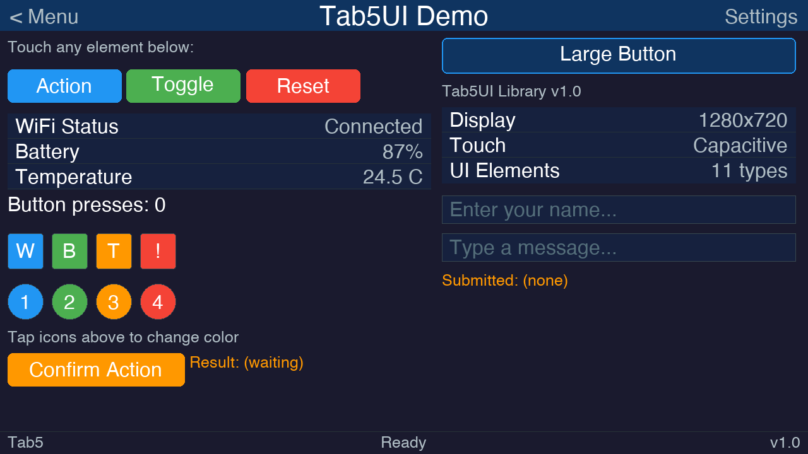
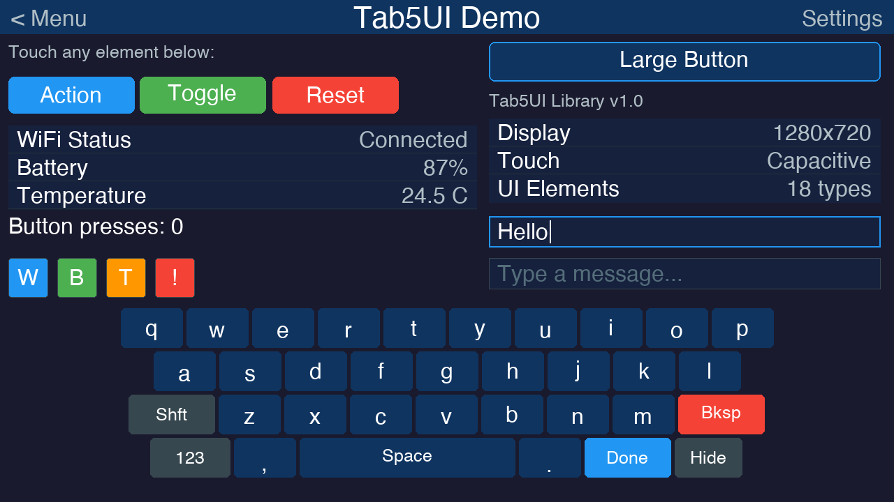
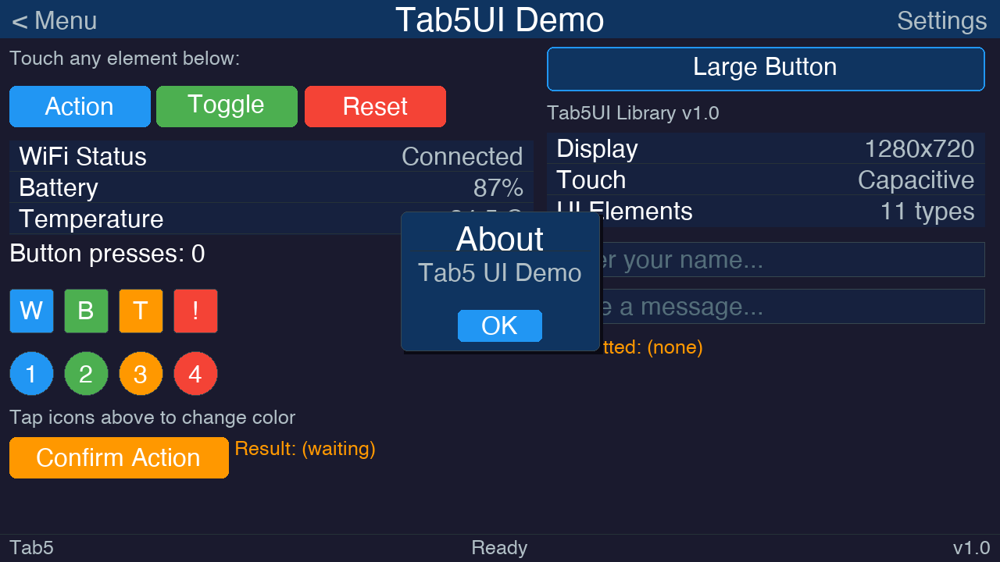
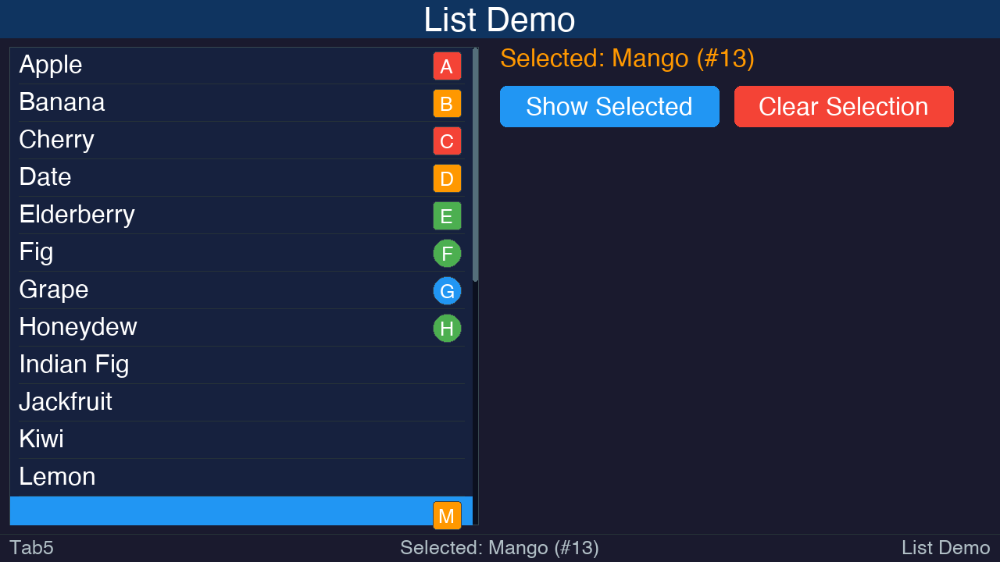
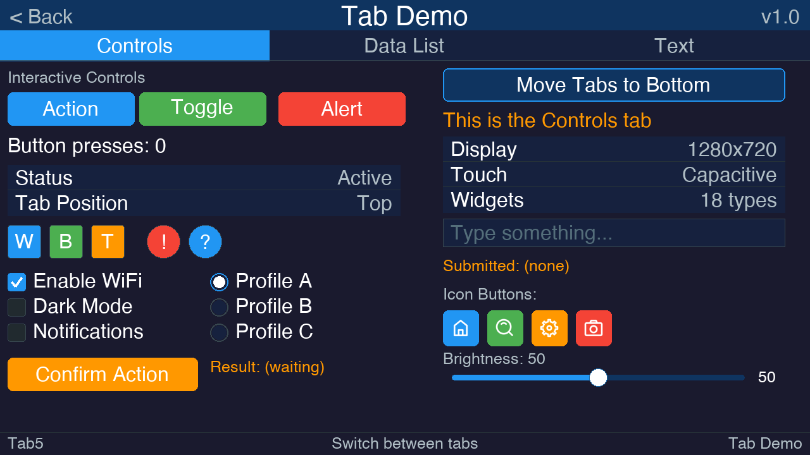
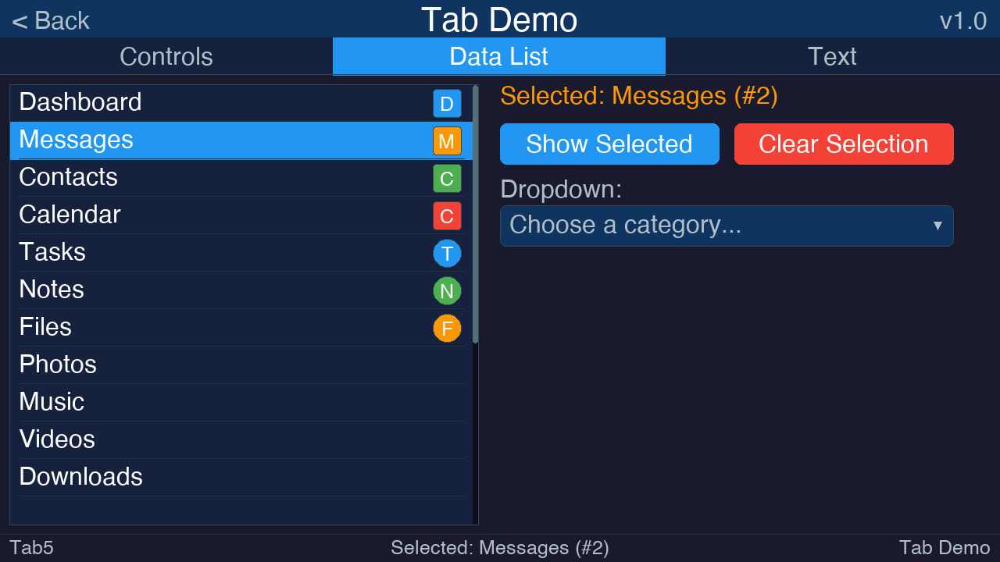
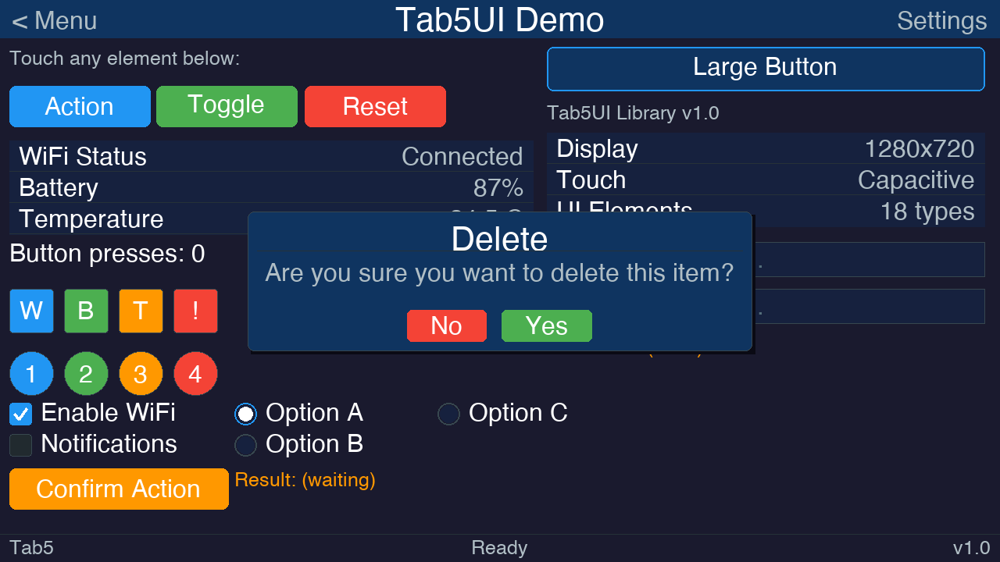
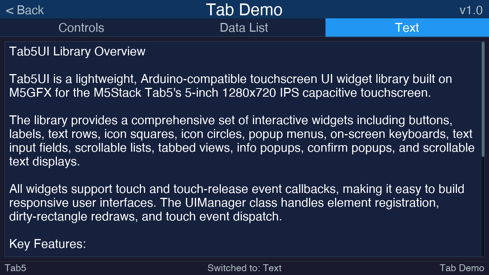

# Tab5UI — Touchscreen UI Library for M5Stack Tab5

A lightweight, Arduino-compatible UI widget library built on **M5GFX** for the M5Stack Tab5's 5-inch **1280×720** IPS capacitive touchscreen. Supports both **landscape** (1280×720) and **portrait** (720×1280) orientations.

## Features

| Widget | Description |
|---|---|
| **UILabel** | Static/dynamic text with alignment, color, and background options |
| **UIButton** | Rounded-rect button with press feedback and customizable colors |
| **UITitleBar** | Full-width top bar with center title, optional left/right touch zones |
| **UIStatusBar** | Full-width bottom bar with left/center/right text |
| **UITextRow** | Key-value row with label on left, value on right, and dividers |
| **UIIconSquare** | Colored square icon with optional character overlay |
| **UIIconCircle** | Colored circle icon with circular hit-testing |
| **UIMenu** | Modal popup menu with selectable items, separators, and auto-dismiss |
| **UITextInput** | Single-line text input field with placeholder and focus highlight |
| **UIKeyboard** | Full-screen modal QWERTY touch keyboard with Shift, Symbols, and Hide |
| **UIList** | Scrollable list with touch-drag scrolling, item selection, and scrollbar |
| **UITabView** | Multi-page tabbed container with configurable top/bottom tab bar |
| **UIInfoPopup** | Auto-sized modal info popup with title, message, and OK button |
| **UIConfirmPopup** | Auto-sized modal confirm popup with title, message, and Yes/No buttons |
| **UIScrollText** | Scrollable text display with basic Markdown rendering (headings, bold, italic, code, bullets, rules) |
| **UICheckbox** | Toggleable checkbox with label, checked state, and touch callbacks |
| **UIRadioButton** | Selectable radio button with label, managed by UIRadioGroup for mutual exclusion |
| **UIDropdown** | Compact dropdown selector with scrollable list overlay, icons, and all UIList features |
| **UIManager** | Registers elements, dispatches touch events, manages dirty redraws |

### Touch Handling

Every widget supports two callbacks:

```cpp
element.setOnTouch([](TouchEvent e) {
    // Finger touched down on this element
});

element.setOnTouchRelease([](TouchEvent e) {
    // Finger lifted from this element
});
```

The `UIManager::update()` method handles all touch detection, hit-testing (including circular hit-test for `UIIconCircle`), and dirty-region redraws automatically.

---

## Installation

### Arduino IDE (manual)

1. Copy the entire `Tab5UI` folder into your Arduino libraries directory:
   - **macOS:** `~/Documents/Arduino/libraries/Tab5UI/`
   - **Windows:** `Documents\Arduino\libraries\Tab5UI\`
   - **Linux:** `~/Arduino/libraries/Tab5UI/`

2. Install the **M5GFX** library via the Arduino Library Manager:
   - *Sketch → Include Library → Manage Libraries → search "M5GFX"*

3. Select board **M5Stack Tab5** (or the appropriate ESP32-S3 board).

### PlatformIO

Add to `platformio.ini`:

```ini
[env:tab5]
platform = espressif32
board = m5stack-tab5
framework = arduino
lib_deps =
    m5stack/M5GFX
    Tab5UI
```

---

## Quick Start

```cpp
#include <M5GFX.h>
#include <Tab5UI.h>

M5GFX display;
UIManager ui(display);

UITitleBar  titleBar("My App");
UIStatusBar statusBar("Ready");
UIButton    btn(50, 100, 200, 52, "Press Me");

void setup() {
    display.init();
    display.setRotation(1);           // Landscape (use 0 for portrait)
    Tab5UI::init(display);            // Must be called after init + rotation
    display.setBrightness(128);
    display.setFont(&fonts::DejaVu18);

    btn.setOnTouchRelease([](TouchEvent e) {
        statusBar.setText("Button pressed!");
    });

    ui.setBackground(Tab5Theme::BG_DARK);
    ui.clearScreen();
    ui.addElement(&titleBar);
    ui.addElement(&btn);
    ui.addElement(&statusBar);
    ui.setContentArea(TAB5_TITLE_H, Tab5UI::screenH() - TAB5_STATUS_H);
    ui.drawAll();
}

void loop() {
    ui.update();
    delay(10);
}
```

---

## Orientation Support

Tab5UI works in both **landscape** (1280×720, rotation 1) and **portrait** (720×1280, rotation 0) orientations.

Call `Tab5UI::init(display)` once in `setup()` **after** `display.init()` and `display.setRotation()`:

```cpp
void setup() {
    display.init();
    display.setRotation(0);        // 0 = portrait, 1 = landscape
    Tab5UI::init(display);         // Captures runtime screen dimensions
    // ...
}
```

### What adapts automatically

| Widget | Adaptation |
|---|---|
| **UITitleBar** | Stretches to screen width |
| **UIStatusBar** | Stretches to screen width, repositions to screen bottom |
| **UIKeyboard** | Repositions to screen bottom, keys scale to fit width |
| **UIInfoPopup** | Auto-sizes and centers within actual screen bounds |
| **UIConfirmPopup** | Auto-sizes and centers within actual screen bounds |
| **UIDropdown** | Overflow detection uses actual screen height |
| **UIManager** | Content area bottom defaults to actual screen height |

### Runtime dimension queries

```cpp
int16_t w = Tab5UI::screenW();   // Actual screen width  (720 or 1280)
int16_t h = Tab5UI::screenH();   // Actual screen height (1280 or 720)
```

Use these instead of the compile-time `TAB5_SCREEN_W` / `TAB5_SCREEN_H` macros when you need values that match the current orientation.

### Positioning widgets for portrait

Since widget objects are constructed globally (before `setup()`), use compile-time defaults or placeholder values in constructors, then call `setPosition()` / `setSize()` in `setup()` after `Tab5UI::init()`. See the **WiFi Scanner** demo for a complete portrait example.

---

## API Reference

### Tab5UI Namespace

```cpp
namespace Tab5UI {
    void     init(M5GFX& gfx);   // Capture runtime screen dimensions
    int16_t  screenW();           // Current screen width
    int16_t  screenH();           // Current screen height
}
```

### Screen Constants

| Constant | Value | Description |
|---|---|---|
| `TAB5_SCREEN_W` | 1280 | Screen width in pixels |
| `TAB5_SCREEN_H` | 720 | Screen height in pixels |
| `TAB5_TITLE_H` | 48 | Default title bar height |
| `TAB5_STATUS_H` | 36 | Default status bar height |
| `TAB5_BTN_H` | 52 | Default button height |
| `TAB5_BTN_W` | 160 | Default button width |
| `TAB5_BTN_R` | 8 | Default button corner radius |
| `TAB5_ICON_SIZE` | 44 | Default icon dimension |
| `TAB5_MENU_ITEM_H` | 48 | Menu item row height |
| `TAB5_MENU_W` | 260 | Default menu popup width |
| `TAB5_MENU_MAX_ITEMS` | 12 | Max items per menu |
| `TAB5_KB_KEY_W` | 88 | Keyboard key width |
| `TAB5_KB_KEY_H` | 56 | Keyboard key height |
| `TAB5_KB_H` | 290 | Keyboard panel height |
| `TAB5_INPUT_H` | 44 | Text input field height |
| `TAB5_INPUT_MAX_LEN` | 128 | Max text input length |
| `TAB5_LIST_ITEM_H` | 48 | List item row height |
| `TAB5_LIST_MAX_ITEMS` | 64 | Max items in a list |
| `TAB5_LIST_SCROLLBAR_W` | 6 | Scrollbar width |
| `TAB5_PADDING` | 12 | General padding |

### Theme Colors (`Tab5Theme::`)

| Color | Hex | Use |
|---|---|---|
| `PRIMARY` | `#2196F3` | Buttons, icons |
| `PRIMARY_DARK` | `#1565C0` | Pressed state |
| `SECONDARY` | `#4CAF50` | Toggle/success |
| `ACCENT` | `#FF9800` | Highlights |
| `DANGER` | `#F44336` | Destructive actions |
| `BG_DARK` | `#1A1A2E` | Screen background |
| `BG_MEDIUM` | `#16213E` | Row backgrounds |
| `SURFACE` | `#0F3460` | Cards/surfaces |
| `TEXT_PRIMARY` | `#FFFFFF` | Main text |
| `TEXT_SECONDARY` | `#B0BEC5` | Subtle text |

### UIElement (base class)

```cpp
void setPosition(int16_t x, int16_t y);
void setSize(int16_t w, int16_t h);
void setVisible(bool v);
void setEnabled(bool e);
void setTag(const char* tag);
void setOnTouch(TouchCallback cb);
void setOnTouchRelease(TouchCallback cb);
```

### UILabel

```cpp
UILabel(x, y, w, h, "text", color, textSize);
void setText(const char* text);
const char* getText() const;
void setTextColor(uint32_t color);
void setTextSize(float s);
void setBgColor(uint32_t color);
void setAlign(textdatum_t datum);
```

### UIButton

```cpp
UIButton(x, y, w, h, "label", bgColor, textColor, textSize);
void setLabel(const char* label);
const char* getLabel() const;
void setBgColor(uint32_t c);
void setPressedColor(uint32_t c);
void setCornerRadius(int16_t r);
void setBorderColor(uint32_t c);
```

### UITitleBar

```cpp
UITitleBar("title", bgColor, textColor);
void setTitle(const char* title);
const char* getTitle() const;
void setLeftText(const char* text);    // e.g. "< Back"
void setRightText(const char* text);   // e.g. "Settings"
const char* getLeftText() const;
const char* getRightText() const;
void setOnLeftTouch(TouchCallback cb);
void setOnRightTouch(TouchCallback cb);
```

### UIStatusBar

```cpp
UIStatusBar("text", bgColor, textColor);
void setText(const char* text);
void setLeftText(const char* text);
void setRightText(const char* text);
const char* getText() const;
const char* getLeftText() const;
const char* getRightText() const;
```

### UITextRow

```cpp
UITextRow(x, y, w, "Label", "Value", bgColor, labelColor, valueColor);
void setLabel(const char* label);
void setValue(const char* value);
const char* getLabel() const;
const char* getValue() const;
void setShowDivider(bool show);
```

### UIIconSquare

```cpp
UIIconSquare(x, y, size, fillColor, borderColor);
void setFillColor(uint32_t c);
void setCornerRadius(int16_t r);
void setIconChar(const char* ch);     // Single char drawn centered
void setIconCharColor(uint32_t c);
```

### UIIconCircle

```cpp
UIIconCircle(x, y, radius, fillColor, borderColor);
void setFillColor(uint32_t c);
void setRadius(int16_t r);
void setIconChar(const char* ch);
void setIconCharColor(uint32_t c);
```

### UIMenu

```cpp
UIMenu(x, y, width, bgColor, textColor, highlightColor);
int  addItem(const char* label, TouchCallback onSelect = nullptr);
void addSeparator();
void clearItems();
void setItemEnabled(int index, bool enabled);
void setItemLabel(int index, const char* label);
int  itemCount() const;
void show();              // Open the menu
void hide();              // Close the menu
bool isOpen() const;
void setOnDismiss(TouchCallback cb); // Called when tapping outside
void setBgColor(uint32_t c);
void setTextColor(uint32_t c);
void setHighlightColor(uint32_t c);
void setBorderColor(uint32_t c);
```

**Behavior:** The menu starts hidden. Call `show()` to open it. When visible it
captures all touch input (modal). Tapping an item fires its callback and
auto-closes the menu. Tapping outside dismisses it. Disabled items are drawn
in gray and cannot be selected. Separators render as horizontal divider lines.

### UIKeyboard

```cpp
UIKeyboard();
void show();              // Open the keyboard
void hide();              // Close the keyboard
bool isOpen() const;
void setOnKey(KeyCallback cb);  // Receives each char typed
void setBgColor(uint32_t c);
void setKeyColor(uint32_t c);
void setTextColor(uint32_t c);
```

**Keyboard layers:**
- **Lowercase** — default QWERTY layout
- **Uppercase** — activated by Shift (⇧); auto-reverts after one character
- **Symbols** — numbers and punctuation, activated by "123" key

**Special keys:**
| Key | Action |
|---|---|
| ⇧ (Shift) | Toggle uppercase |
| ⌫ (Backspace) | Delete last character |
| 123 / ABC | Switch between letters and symbols |
| Space | Space character |
| Done | Fires enter (`'\n'`) and closes keyboard |
| ↓ (Hide) | Closes keyboard without submitting |

**Behavior:** The keyboard is modal — when visible it captures all touch
input.  It occupies the bottom 290px of the screen.  It is normally
managed automatically by `UITextInput` but can also be used standalone
with `setOnKey()`.

### UITextInput

```cpp
UITextInput(x, y, width, "placeholder", height, bgColor, textColor, borderColor);
void attachKeyboard(UIKeyboard* kb);  // Required — connect a keyboard
void setText(const char* text);
const char* getText() const;
void clear();
void setPlaceholder(const char* ph);
void setMaxLength(int len);
void focus();             // Open keyboard
void blur();              // Close keyboard
bool isFocused() const;
void setOnSubmit(TextSubmitCallback cb);  // Done key pressed
void setOnChange(TextSubmitCallback cb);  // Each character typed
void setBgColor(uint32_t c);
void setTextColor(uint32_t c);
void setBorderColor(uint32_t c);
void setFocusBorderColor(uint32_t c);
void setPlaceholderColor(uint32_t c);
```

**Behavior:** Tapping the input field opens the attached keyboard and
highlights the border.  Characters are inserted at the cursor.  Pressing
Done fires the `onSubmit` callback and closes the keyboard.  Pressing
Hide (↓) closes the keyboard without firing `onSubmit`.

### UIList

```cpp
UIList(x, y, w, h, bgColor, textColor, selectColor);

// Item management
int  addItem(const char* text);       // Returns item index
int  addItem(const char* text,        // Add item with right-aligned icon
             const char* iconChar,
             uint32_t iconColor = Tab5Theme::PRIMARY,
             bool circle = false,     // false = square, true = circle
             uint32_t iconBorderColor = Tab5Theme::BORDER,
             uint32_t iconCharColor = Tab5Theme::TEXT_PRIMARY);
void removeItem(int index);
void clearItems();
void setItemText(int index, const char* text);
void setItemEnabled(int index, bool enabled);
int  itemCount() const;

// Item icons (add/change/remove after creation)
void setItemIcon(int index, const char* iconChar,
                 uint32_t iconColor = Tab5Theme::PRIMARY,
                 bool circle = false,
                 uint32_t iconBorderColor = Tab5Theme::BORDER,
                 uint32_t iconCharColor = Tab5Theme::TEXT_PRIMARY);
void clearItemIcon(int index);

// Selection
int  getSelectedIndex() const;        // -1 if none
const char* getSelectedText() const;  // "" if none
void setSelectedIndex(int index);
void clearSelection();

// Scrolling
void scrollTo(int16_t offset);        // Pixel offset from top
void scrollToItem(int index);         // Ensure item is visible

// Callbacks
void setOnSelect(ListSelectCallback cb); // void(int index, const char* text)

// Appearance
void setBgColor(uint32_t c);
void setTextColor(uint32_t c);
void setSelectColor(uint32_t c);      // Highlight color for selected item
void setBorderColor(uint32_t c);
void setTextSize(float s);            // Font size; items auto-scale height
void setItemHeight(int16_t h);        // Fixed height (disables auto-scale)
```

**Icons:** Each list item can optionally display a right-aligned icon (square
or circle) matching the library's `UIIconSquare` / `UIIconCircle` style.  Use
the two-argument `addItem()` to create items with icons, or call
`setItemIcon()` / `clearItemIcon()` to change icons after creation.  Icon size
scales automatically with the item row height.

**Text size:** Call `setTextSize()` to change the font.  Item row heights
automatically scale to fit the text plus padding.  Calling `setItemHeight()`
switches to a fixed row height and disables auto-scaling.

**Behavior:** Drag up/down to scroll through the list. Tap an item to
select it (highlighted in the selection color). The widget distinguishes
taps from drags using an 8px threshold. A scrollbar appears automatically
when content overflows the visible area. Up to 64 items are supported.
Disabled items are drawn in gray and cannot be selected.

### UITabView

```cpp
UITabView(x, y, w, h, TabPosition::TOP, barColor, activeColor, textColor);

// Page management
int  addPage(const char* label);      // Returns page index
void addChild(int pageIndex, UIElement* child);
void removeChild(int pageIndex, UIElement* child);
void clearPage(int pageIndex);
void clearAllPages();
int  pageCount() const;

// Active page
int  getActivePage() const;
void setActivePage(int index);

// Page labels
void setPageLabel(int pageIndex, const char* label);
const char* getPageLabel(int pageIndex) const;

// Tab bar position
void setTabPosition(TabPosition pos); // TabPosition::TOP or TabPosition::BOTTOM
TabPosition getTabPosition() const;

// Callbacks
void setOnTabChange(TabChangeCallback cb); // void(int pageIndex)

// Content area helpers (for positioning children)
int16_t contentX() const;
int16_t contentY() const;             // Accounts for tab bar placement
int16_t contentW() const;
int16_t contentH() const;             // Total height minus tab bar

// Appearance
void setBarColor(uint32_t c);
void setActiveColor(uint32_t c);
void setInactiveColor(uint32_t c);
void setTextColor(uint32_t c);
void setActiveTextColor(uint32_t c);
void setBorderColor(uint32_t c);
void setTabBarHeight(int16_t h);      // Default: 48px
```

**Tab bar placement:** The tab bar can be at the `TOP` (default) or `BOTTOM`
of the widget.  Call `setTabPosition()` to move it at runtime.

**Child elements:** Each tab page holds up to 24 child elements.  Position
children relative to `contentY()` (which shifts depending on tab placement).
Only the active page's children are drawn and receive touch events.  The tab
view clips children to its content area.

**Touch dispatch:** Tapping a tab switches pages.  Touches in the content area
are forwarded to the active page's children, including drag/move events
for scrollable widgets like `UIList`.

### UIInfoPopup

```cpp
UIInfoPopup("Title", "Message text");
void show();                          // Display centered, auto-sized
void hide();
bool isOpen() const;
void setTitle(const char* title);
void setMessage(const char* msg);
void setButtonLabel(const char* label); // Default: "OK"
void setOnDismiss(TouchCallback cb);
void setBgColor(uint32_t c);
void setTitleColor(uint32_t c);
void setTextColor(uint32_t c);
void setBtnColor(uint32_t c);
void setBorderColor(uint32_t c);
```

**Behavior:** The popup auto-sizes to fit its title and message text,
word-wrapping long messages.  Dimensions are clamped so the popup never
exceeds the screen (40px margin on each side).  It is always centered.
Tapping the OK button or outside the popup dismisses it.  The popup is
modal — it captures all touch input while visible.

### UIConfirmPopup

```cpp
UIConfirmPopup("Title", "Are you sure?");
void show();                          // Display centered, auto-sized
void hide();
bool isOpen() const;
void setTitle(const char* title);
void setMessage(const char* msg);
void setYesLabel(const char* label);  // Default: "Yes"
void setNoLabel(const char* label);   // Default: "No"
ConfirmResult getResult() const;      // ConfirmResult::YES or ConfirmResult::NO
void setOnConfirm(ConfirmCallback cb); // void(ConfirmResult result)
void setBgColor(uint32_t c);
void setTitleColor(uint32_t c);
void setTextColor(uint32_t c);
void setYesBtnColor(uint32_t c);      // Default: SECONDARY (green)
void setNoBtnColor(uint32_t c);       // Default: DANGER (red)
void setBorderColor(uint32_t c);
```

**Behavior:** Works identically to `UIInfoPopup` (auto-sized, centered, modal,
word-wrapping) but presents two buttons: **No** (left, red) and **Yes** (right,
green).  Use `setOnConfirm()` to receive a `ConfirmResult` enum indicating
which button was pressed.  Tapping outside the popup is treated as **No**.
The last result is also available via `getResult()`.

### UIScrollText

```cpp
UIScrollText(x, y, w, h, bgColor, textColor);
void setText(const char* text);       // Set text content (up to 2048 chars)
const char* getText() const;

// Appearance
void setTextSize(float s);            // Font size (default: TAB5_FONT_SIZE_MD)
void setBgColor(uint32_t c);
void setTextColor(uint32_t c);
void setBorderColor(uint32_t c);

// Markdown colors
void setHeadingColor(uint32_t c);     // Heading text      (default: PRIMARY)
void setBoldColor(uint32_t c);        // **bold** text      (default: ACCENT)
void setItalicColor(uint32_t c);      // *italic* text      (default: TEXT_SECONDARY)
void setCodeColor(uint32_t c);        // `code` text        (default: SECONDARY)
void setCodeBgColor(uint32_t c);      // `code` background  (default: 0x0A0A1E)
void setRuleColor(uint32_t c);        // Horizontal rules   (default: DIVIDER)
void setBulletColor(uint32_t c);      // Bullet markers     (default: PRIMARY)

// Scroll control
void scrollTo(int16_t offset);        // Pixel offset from top
void scrollToTop();
void scrollToBottom();
```

**Behavior:** Displays read-only text with basic **Markdown rendering**.
Text is automatically word-wrapped to the widget width.  When the content
exceeds the visible area, a scrollbar appears on the right and the content
can be scrolled by touch-dragging up/down.

**Supported Markdown syntax:**

| Syntax | Rendering |
|--------|-----------|
| `# Heading` | Large heading (H1) with underline |
| `## Heading` | Medium heading (H2) |
| `### Heading` | Small heading (H3) |
| `**bold**` | Bold text (accent color) |
| `*italic*` | Italic text (secondary color) |
| `` `code` `` | Inline code (green on dark background) |
| `- item` or `* item` | Bullet list with • prefix |
| `---` or `***` | Horizontal rule |

Since the M5GFX environment has only one font loaded (DejaVu18), bold and
italic styles are rendered as **color changes** rather than font-weight or
font-style changes.  Headings use larger text sizes.  All markdown colors
are individually customizable via setter methods.

### UICheckbox

```cpp
UICheckbox(x, y, w, h, "label", checked, boxColor, textColor, textSize);

// State
void setChecked(bool c);              // Set checked state
bool isChecked() const;               // Get checked state

// Label
void setLabel(const char* label);
const char* getLabel() const;

// Appearance
void setBoxColor(uint32_t c);         // Checkbox fill when checked (default: PRIMARY)
uint32_t getBoxColor() const;
void setCheckColor(uint32_t c);       // Checkmark color (default: TEXT_PRIMARY)
uint32_t getCheckColor() const;
void setTextColor(uint32_t c);
uint32_t getTextColor() const;
void setTextSize(float s);
float getTextSize() const;
void setBorderColor(uint32_t c);
```

**Behavior:** Displays a 28×28 rounded checkbox with an adjacent text label.
Tapping anywhere on the widget toggles the checked state.  When checked, the
box fills with `boxColor` and displays a checkmark in `checkColor`.  When
unchecked, the box shows an empty bordered square.  The `TOUCH_RELEASE`
callback fires after the state has been toggled, so `isChecked()` returns
the new value inside the callback.

### UIRadioButton / UIRadioGroup

```cpp
// Group (manages mutual exclusion)
UIRadioGroup group;
group.addButton(UIRadioButton* btn);  // Add a button to the group
group.select(UIRadioButton* btn);     // Programmatically select a button
int  getSelectedIndex() const;        // Index of selected button (-1 if none)
UIRadioButton* getSelected() const;   // Pointer to selected button

// Button
UIRadioButton(x, y, w, h, "label", &group, circleColor, textColor, textSize);

// State
void setSelected(bool s);             // Set selection state
bool isSelected() const;              // Get selection state

// Group
void setGroup(UIRadioGroup* g);       // Assign to a group
UIRadioGroup* getGroup() const;

// Label
void setLabel(const char* label);
const char* getLabel() const;

// Appearance
void setCircleColor(uint32_t c);      // Outer ring color (default: PRIMARY)
uint32_t getCircleColor() const;
void setDotColor(uint32_t c);         // Inner dot color (default: TEXT_PRIMARY)
uint32_t getDotColor() const;
void setTextColor(uint32_t c);
uint32_t getTextColor() const;
void setTextSize(float s);
float getTextSize() const;
void setBorderColor(uint32_t c);
```

**Behavior:** Displays a circular radio button (radius 14) with an adjacent
text label.  When a `UIRadioGroup` is provided (via constructor or
`setGroup()`), tapping one button automatically deselects the previously
selected button in the group.  The first button added to a group is selected
by default.  The group supports up to 12 buttons.  Pass the group pointer in
the constructor to auto-register, or call `group.addButton()` manually.

### UIDropdown

```cpp
UIDropdown(x, y, w, h, "placeholder", bgColor, textColor, selectColor);

// Item management (identical to UIList)
int  addItem(const char* text);
int  addItem(const char* text, const char* iconChar,
             uint32_t iconColor = Tab5Theme::PRIMARY,
             bool circle = false,
             uint32_t iconBorderColor = Tab5Theme::BORDER,
             uint32_t iconCharColor = Tab5Theme::TEXT_PRIMARY);
void removeItem(int index);
void clearItems();
void setItemText(int index, const char* text);
void setItemEnabled(int index, bool enabled);
int  itemCount() const;

// Item icons
void setItemIcon(int index, const char* iconChar,
                 uint32_t iconColor, bool circle,
                 uint32_t iconBorderColor, uint32_t iconCharColor);
void clearItemIcon(int index);

// Selection
int  getSelectedIndex() const;        // -1 if none
const char* getSelectedText() const;  // "" if none
void setSelectedIndex(int index);
void clearSelection();

// Open / Close
void open();
void close();
bool isOpen() const;

// Callbacks
void setOnSelect(ListSelectCallback cb);

// Appearance
void setPlaceholder(const char* text);
void setBgColor(uint32_t c);
void setTextColor(uint32_t c);
void setSelectColor(uint32_t c);
void setBorderColor(uint32_t c);
void setTextSize(float s);
void setMaxVisibleItems(int n);       // Max items shown when open (default 6)
```

**Behavior:** The dropdown appears as a compact button showing the selected
item's text (or a placeholder when nothing is selected) with a ▼ indicator.
Tapping opens a scrollable list overlay directly below (or above if near the
screen bottom).  The overlay supports drag-scrolling with scrollbar, item
icons (square or circle), and selection highlighting — identical to UIList.
Tapping an item selects it, fires the callback, and auto-closes the dropdown.
Tapping outside the list dismisses it.  The dropdown participates in the
modal overlay system, capturing all touch input while open.

### UIManager

```cpp
UIManager(M5GFX& gfx);
void addElement(UIElement* element);
void removeElement(UIElement* element);
void clearElements();
void setBackground(uint32_t color);
void clearScreen();
void drawAll();           // Full redraw
void drawDirty();         // Only changed elements
void update();            // Touch + dirty redraw (call in loop)
UIElement* findByTag(const char* tag);
void setContentArea(int16_t top, int16_t bottom);
```

---

## File Structure

```
Tab5UI/
├── Tab5UI.h                          # Header — all class declarations
├── Tab5UI.cpp                        # Implementation
├── library.properties                # Arduino IDE metadata
├── library.json                      # PlatformIO metadata
├── README.md                         # This file
├── LICENSE                           # GNU GPL v3
├── screenshots/                      # Demo screenshots
│   ├── screenshot1_initial.png
│   ├── screenshot2_menu.png
│   ├── screenshot3_keyboard.png
│   ├── screenshot4_popup.png
│   ├── screenshot5_list.png
│   ├── screenshot6_tab_controls.png
│   ├── screenshot7_tab_list.png
│   ├── screenshot8_confirm_popup.png
│   └── screenshot9_tab_text.png
└── examples/
    ├── Tab5UI_Demo/
    │   └── Tab5UI_Demo.ino           # Full demo sketch (landscape)
    ├── Tab5UI_List_Demo/
    │   └── Tab5UI_List_Demo.ino      # List widget demo (landscape)
    ├── Tab5UI_Tab_Demo/
    │   └── Tab5UI_Tab_Demo.ino       # Tab view demo (landscape)
    └── Tab5UI_WiFi_Demo/
        └── Tab5UI_WiFi_Demo.ino      # WiFi scanner demo (portrait)
```

---

## Tips

- Add modal elements (`UIMenu`, `UIKeyboard`) **last** so they draw on top when opened.
- `UITabView` children should be positioned relative to `tabs.contentY()` — this accounts for tab bar placement.
- When switching tab bar position at runtime, reposition all children and call `tabs.setDirty(true)`.
- Multiple `UITextInput` fields can share a single `UIKeyboard` instance.
- Call `ui.update()` in `loop()` — it handles touch polling, event dispatch, and dirty redraws.
- Use `startWrite()` / `endWrite()` batching (handled internally by `drawAll` / `drawDirty`).
- Set `display.setFont(&fonts::DejaVu18)` for crisp text at the Tab5's resolution.
- Use `setTag("myBtn")` + `findByTag("myBtn")` to look up elements by name.
- All colors are specified as 24-bit RGB hex values (e.g. `0xFF9800`).
- For portrait orientation, call `display.setRotation(0)` then `Tab5UI::init(display)` — see the **WiFi Scanner** demo.

---

## Screenshots

*Captured from the included demo sketch running on a 1280×720 display.*

### Initial State


### Popup Menu


### On-Screen Keyboard


### Info Popup


### List Demo


### Tab Demo — Controls


### Tab Demo — Data List


### Confirm Popup


### Tab Demo — Scrollable Text


## License

This project is licensed under the [GNU General Public License v3.0](LICENSE).
